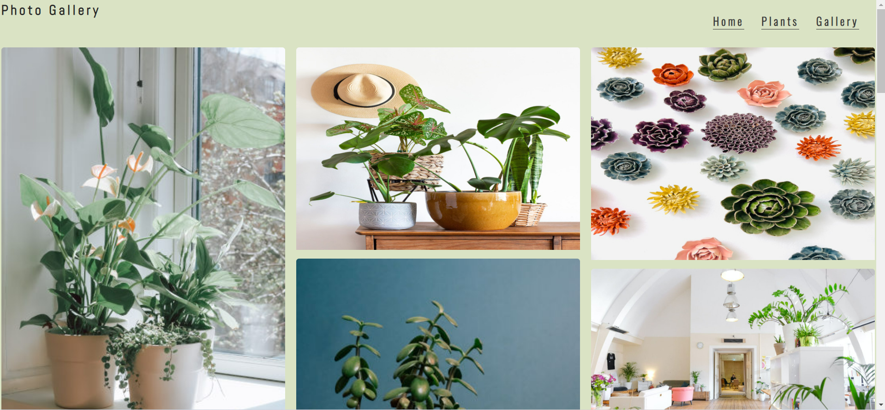

# Little Jungle

Little jungle is a website that intends encourage people to create a green space at their home with low maintenance plants. The website provide information about easy care plants to have at home and intends to target people who don’t have experience with gardening giving some advice and suggestions about plants. Let’s green it!

## Existing Features

- __Navigation Bar__

-	In this section, user can explore the site directly, from page to page on all devices easily. The responsive navigation bar includes identical links to the Home, Plants and Gallery pages for an easy navigation.

- __The landing page image__

The landing page with a striking image introduce the user to the Little Jungle. The landing page consists in a photograph of a cosy room decorated with plants. Also, the user can find in the footer`s webpage the social media icons.

- __The Footer__ 

  - The footer section includes links to the relevant social media sites for Love Running. The links will open to a new tab to allow easy navigation for the user. 
  - The footer is valuable to the user as it encourages them to keep connected via social media

- __The Plant Page__

  - The plant section will allow the user to find out different types of easy care plants, as well as the benefits of having plants at home. 

- __The Gallery Page__

  - This section will show to the user some room ideas with plants in the home design.  The user will see a mix of plants placed to inspire them to create a similar environment in their house.
  
  
  
  
### Features Left to Implement

- Another feature idea

### Main technologies

In this project, it has been used HTML, CSS technologies learned in The Learning Management System (LMS) by Code Institute program HTML/CSS Essentials.
As defined by Jack Vaughan (2019), in computing data is information that has been translated into a form that is efficient for movement or processing.
Information is presented to assist people get a quick understanding about easy care plants. The site owner`s aims is to present data to encourage people to bring some green to their home.

## Testing 

In this section, you need to convince the assessor that you have conducted enough testing to legitimately believe that the site works well. Essentially, in this part you will want to go over all of your project’s features and ensure that they all work as intended, with the project providing an easy and straightforward way for the users to achieve their goals.

In addition, you should mention in this section how your project looks and works on different browsers and screen sizes.

You should also mention in this section any interesting bugs or problems you discovered during your testing, even if you haven't addressed them yet.

If this section grows too long, you may want to split it off into a separate file and link to it from here.

### Validator Testing 

- HTML
  - No errors were returned when passing through the official [W3C validator](https://validator.w3.org/nu/?doc=https%3A%2F%2Fcode-institute-org.github.io%2Flove-running-2.0%2Findex.html)
- CSS
  - No errors were found when passing through the official [(Jigsaw) validator](https://jigsaw.w3.org/css-validator/validator?uri=https%3A%2F%2Fvalidator.w3.org%2Fnu%2F%3Fdoc%3Dhttps%253A%252F%252Fcode-institute-org.github.io%252Flove-running-2.0%252Findex.html&profile=css3svg&usermedium=all&warning=1&vextwarning=&lang=en#css)

### Unfixed Bugs

You will need to mention unfixed bugs and why they were not fixed. This section should include shortcomings of the frameworks or technologies used. Although time can be a big variable to consider, paucity of time and difficulty understanding implementation is not a valid reason to leave bugs unfixed. 

## Deployment

This section should describe the process you went through to deploy the project to a hosting platform (e.g. GitHub) 

- The site was deployed to GitHub pages. The steps to deploy are as follows: 
  - In the GitHub repository, navigate to the Settings tab 
  - From the source section drop-down menu, select the Master Branch
  - Once the master branch has been selected, the page will be automatically refreshed with a detailed ribbon display to indicate the successful deployment. 

The live link can be found here - https://code-institute-org.github.io/love-running-2.0/index.html 

## Credits 

In this section you need to reference where you got your content, media and extra help from. It is common practice to use code from other repositories and tutorials, however, it is important to be very specific about these sources to avoid plagiarism. 

You can break the credits section up into Content and Media, depending on what you have included in your project. 

### Content 

- The text for the Home page was taken from Wikipedia Article A
- Instructions on how to implement form validation on the Sign Up page was taken from [Specific YouTube Tutorial](https://www.youtube.com/)
- The icons in the footer were taken from [Font Awesome](https://fontawesome.com/)

### Media

- The photos used on the home and sign up page are from This Open Source site
- The images used for the gallery page were taken from this other open source site

Congratulations on completing your Readme, you have made another big stride in the direction of being a developer! 

## Other General Project Advice

-

•	Navigation Bar
Gitpod Reminders

